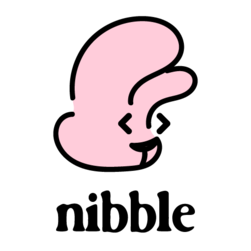
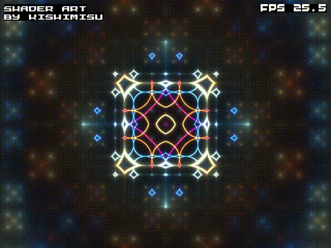
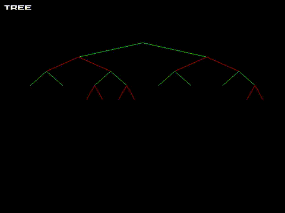
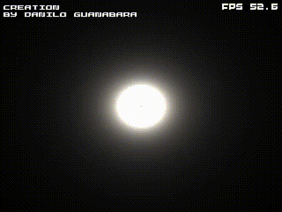
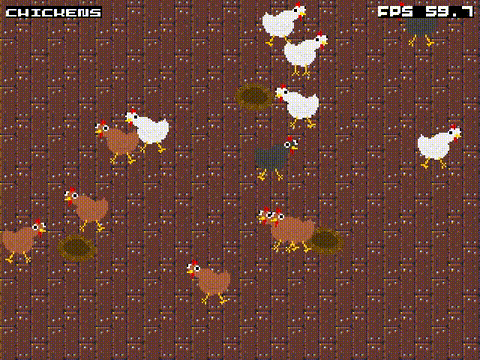

Nibble is C-like systems programming language.

Nibble was written in 3000 lines of C to demonstrate an approach to LLVM IR
generation without relying on external dependencies or heap allocations.

Nibble supports features such as defer, recursion, integer, floating, and boolean types,
structs (simply named types), GLSL-like struct operators, pointers,
function pointers, branching, loops, type checking, basic C interoperability via generic pointers,
and reasonable error messages.

Included are four graphical demos demonstrating Nibble's ability. To try
them out, ensure SDL2 is first installed, as well as Clang, and then run `make`.
Clang will compile `main.c` and output the `nibble` compiler, and `nibble` will
then compile and run the graphical demos. Of these four demos, two demos are multithreaded software renditions
of popular shader-toy demos, one demo is a demonstration of a red-black tree implementation, and the final
demo demonstrates a basic setup for game programming.

Please note, Nibble compiles top down in a single pass and allocas freely, even within loops,
by design. This simplified front-end design greatly and improved `main.c` readability, but causes
stack overflows with lower (and sometimes even higher) clang back-end optimization entablement.
As a fix, I have been meaning to explore stacksave/stackrestore, but my LLVM curiosity has more
or less been satisfied with this project.
